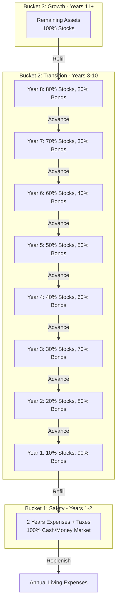
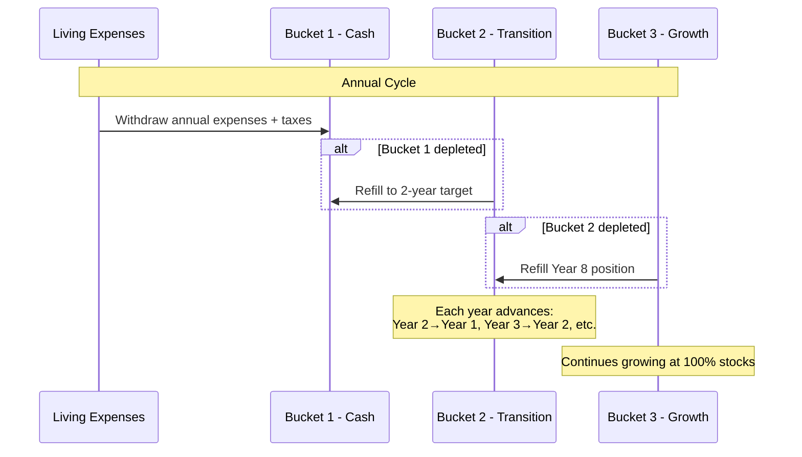
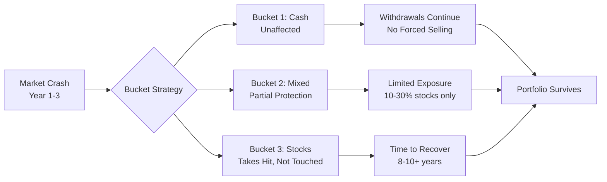
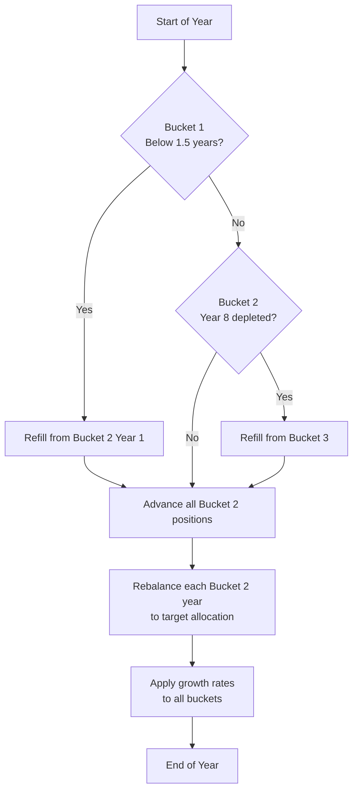
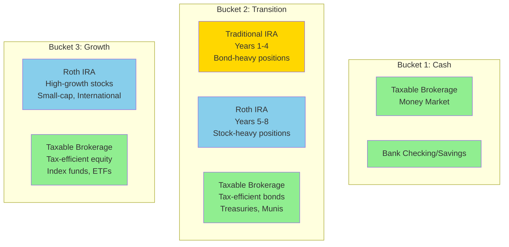
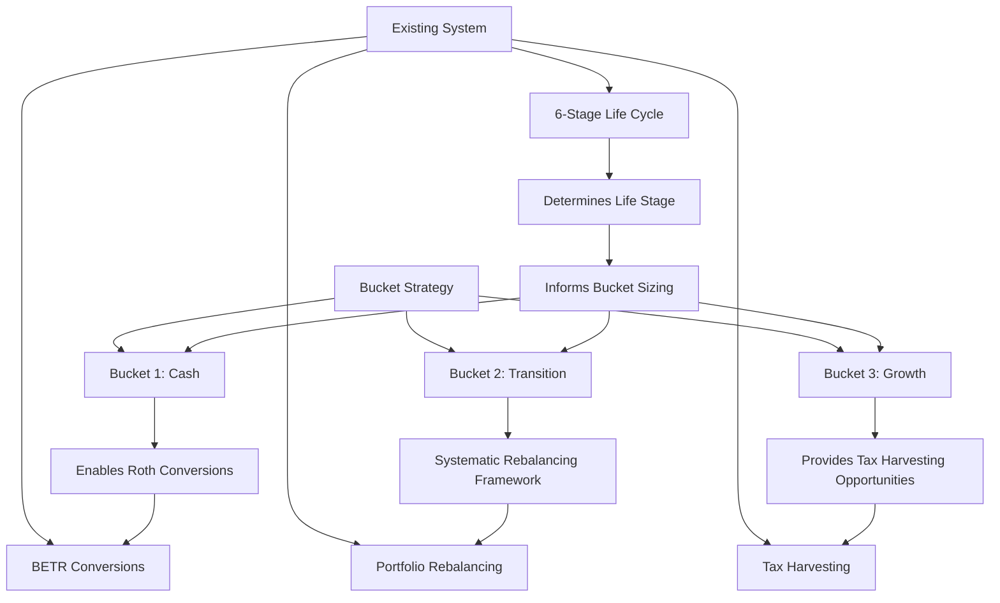

# Retirement Bucket Strategy Guide

> **Strategic Framework for Managing Sequence of Returns Risk**
> 
> A comprehensive analysis of the three-bucket retirement strategy for time-horizon-based asset allocation and risk management.
>
> **Author:** Bob  
> **Date:** 2026-03-07  
> **Version:** 1.0

---

## Table of Contents

1. [Executive Summary](#executive-summary)
2. [The Bucket Strategy Framework](#the-bucket-strategy-framework)
3. [Strategic Rationale](#strategic-rationale)
4. [Bucket Specifications](#bucket-specifications)
5. [Sequence of Returns Risk Analysis](#sequence-of-returns-risk-analysis)
6. [Graduated Allocation Strategy](#graduated-allocation-strategy)
7. [Rebalancing Mechanics](#rebalancing-mechanics)
8. [Tax-Efficient Implementation](#tax-efficient-implementation)
9. [Life Stage Considerations](#life-stage-considerations)
10. [Integration with Existing System](#integration-with-existing-system)
11. [Optimal Bucket Sizing](#optimal-bucket-sizing)
12. [Market Volatility Management](#market-volatility-management)
13. [Implementation Recommendations](#implementation-recommendations)
14. [Variations and Customizations](#variations-and-customizations)
15. [Strengths and Limitations](#strengths-and-limitations)
16. [Best Practices](#best-practices)
17. [References and Further Reading](#references-and-further-reading)

---

## Executive Summary

The **three-bucket strategy** is a time-horizon-based approach to retirement portfolio management that addresses sequence of returns risk by segregating assets based on when they will be needed. This strategy provides:

- **Psychological comfort** through dedicated cash reserves
- **Sequence risk mitigation** via time-segmented allocations
- **Systematic rebalancing** from growth to safety buckets
- **Flexibility** to adapt to market conditions

### Key Components

| Bucket | Time Horizon | Allocation | Purpose |
|--------|--------------|------------|---------|
| **Bucket 1** | Years 1-2 | 100% Cash/Money Market | Immediate liquidity, market crash protection |
| **Bucket 2** | Years 3-10 | Graduated 10%-80% stocks | Transition zone, moderate growth with stability |
| **Bucket 3** | Years 11+ | 100% Stocks | Long-term growth, wealth preservation |

### Strategic Advantages

✅ **Eliminates forced selling** during market downturns  
✅ **Provides 2-10 year buffer** against sequence risk  
✅ **Maintains growth potential** for long-term needs  
✅ **Psychologically reassuring** with visible cash reserves  
✅ **Systematic rebalancing** built into the framework

### Integration Opportunities

This bucket strategy complements the existing retirement planning system's:
- 6-stage life-cycle approach ([`strategy.py`](strategy.py))
- BETR-validated Roth conversions ([`betr_roth_conversion.py`](betr_roth_conversion.py))
- Tax-loss harvesting ([`tax_harvesting.py`](tax_harvesting.py))
- Portfolio rebalancing ([`portfolio_rebalancing.py`](portfolio_rebalancing.py))
- RMD management

---

## The Bucket Strategy Framework

### Overview

The bucket strategy divides retirement assets into three distinct "buckets" based on time horizons, with each bucket having a specific investment allocation and purpose.



### Core Principles

1. **Time Segmentation**: Assets are allocated based on when they'll be needed
2. **Risk Graduation**: Risk increases with time horizon (cash → bonds/stocks → stocks)
3. **Systematic Flow**: Money flows from Bucket 3 → Bucket 2 → Bucket 1 → Expenses
4. **Market Independence**: Near-term needs are insulated from market volatility

### Fund Flow Mechanics



---

## Strategic Rationale

### Why the Bucket Strategy Works

#### 1. Sequence of Returns Risk Mitigation

**The Problem**: Early retirement losses can devastate a portfolio due to the mathematical impact of withdrawals during down markets.

**Example Scenario**:
- Portfolio: $1,000,000
- Annual withdrawal: $40,000 (4%)
- Year 1 return: -20%

**Without bucket strategy**:
- End Year 1: $800,000 - $40,000 = $760,000
- Recovery needed: 31.6% just to get back to $1M
- Permanent portfolio damage

**With bucket strategy**:
- Bucket 1 ($80,000 cash): Unaffected
- Bucket 2 ($320,000 at ~40% avg stocks): -8% = $294,400
- Bucket 3 ($600,000 at 100% stocks): -20% = $480,000
- Total after loss: $854,400
- Year 1 withdrawal from Bucket 1: $40,000
- Remaining: $814,400
- **Recovery needed**: Only 22.8% vs 31.6% traditional

**Key Insight**: The bucket strategy reduces the impact of early losses by ~30% through strategic asset placement.

#### 2. Psychological Benefits

**Behavioral Finance Insight**: Retirees with visible cash reserves are less likely to panic-sell during market downturns.

- **Tangible security**: "I have 2 years of expenses in cash"
- **Reduced anxiety**: No need to check portfolio daily
- **Better decisions**: Can wait out market volatility
- **Sleep factor**: Peace of mind during bear markets

#### 3. Time Horizon Alignment

Each bucket's allocation matches its time horizon:

| Bucket | Time Horizon | Appropriate Risk | Rationale |
|--------|--------------|------------------|-----------|
| 1 | 0-2 years | Zero | Capital preservation, no time to recover from losses |
| 2 | 3-10 years | Moderate | Balanced growth and stability, some recovery time |
| 3 | 11+ years | High | Full market exposure, ample time to recover from volatility |

This alignment follows modern portfolio theory: **risk capacity increases with time horizon**.

#### 4. Systematic Rebalancing

The bucket structure forces disciplined rebalancing:

- **Bull markets**: Bucket 3 grows faster → more available to refill Bucket 2
- **Bear markets**: Bucket 1 & 2 protect against forced selling
- **Automatic**: Refilling buckets naturally rebalances (sell high, buy low)

---

## Bucket Specifications

### Bucket 1: Safety (Years 1-2)

**Purpose**: Immediate liquidity and market crash protection

**Allocation**: 100% Cash/Money Market

**Size**: 2 years of living expenses + estimated taxes

**Calculation**:
```
Bucket 1 Size = (Annual Expenses + Annual Taxes) × 2

Example:
- Annual expenses: $80,000
- Estimated taxes: $12,000
- Bucket 1 = ($80,000 + $12,000) × 2 = $184,000
```

**Investment Vehicles**:
- Money market funds (e.g., VMFXX, SPAXX)
- High-yield savings accounts (FDIC insured)
- Treasury bills (1-3 month maturity)
- Bank checking/savings accounts

**Characteristics**:
- ✅ Zero volatility
- ✅ Immediate liquidity (T+0 or T+1)
- ✅ FDIC/SIPC protected
- ⚠️ Low returns (inflation risk over long term)
- ⚠️ Opportunity cost vs. invested assets

**Refill Trigger**: When balance drops below 1.5 years of expenses

**Refill Source**: Bucket 2, Year 1 position

---

### Bucket 2: Transition Zone (Years 3-10)

**Purpose**: Bridge between safety and growth with graduated risk

**Allocation**: Graduated from 10% to 80% stocks over 8 years

**Size**: 8 years of living expenses + estimated taxes

**Calculation**:
```
Bucket 2 Size = (Annual Expenses + Annual Taxes) × 8

Example:
- Annual expenses: $80,000
- Estimated taxes: $12,000
- Bucket 2 = ($80,000 + $12,000) × 8 = $736,000
```

**Graduated Allocation Structure**:

| Year Position | Stock % | Bond/MM % | Amount (Example) | Purpose |
|---------------|---------|-----------|------------------|---------|
| Year 1 | 10% | 90% | $92,000 | Near-term stability |
| Year 2 | 20% | 80% | $92,000 | Slight growth exposure |
| Year 3 | 30% | 70% | $92,000 | Balanced transition |
| Year 4 | 40% | 60% | $92,000 | Moderate growth |
| Year 5 | 50% | 50% | $92,000 | Equal balance |
| Year 6 | 60% | 40% | $92,000 | Growth emphasis |
| Year 7 | 70% | 30% | $92,000 | Strong growth |
| Year 8 | 80% | 20% | $92,000 | Near-equity allocation |

**Investment Vehicles by Position**:

**Years 1-3 (10%-30% stocks)**:
- Bonds: Short-term bond funds (VBIRX, BSV), Treasury funds (VGSH)
- Stocks: Dividend-focused equity funds (VYM, SCHD)

**Years 4-6 (40%-60% stocks)**:
- Bonds: Intermediate-term bond funds (VBIAX, BIV)
- Stocks: Balanced index funds (VTI, VFIAX)

**Years 7-8 (70%-80% stocks)**:
- Bonds: Total bond market (VBTLX, BND)
- Stocks: Total market or S&P 500 index funds

**Characteristics**:
- ✅ Smooth risk transition
- ✅ Moderate growth potential
- ✅ Reduced sequence risk
- ⚠️ More complex to manage
- ⚠️ Requires annual rebalancing

**Refill Trigger**: When Year 8 position is depleted

**Refill Source**: Bucket 3

**Advancement**: Each year, positions advance (Year 2 → Year 1, Year 3 → Year 2, etc.)

---

### Bucket 3: Growth (Years 11+)

**Purpose**: Long-term wealth preservation and growth

**Allocation**: 100% Stocks (equities)

**Size**: All remaining portfolio assets after funding Buckets 1 and 2

**Calculation**:
```
Bucket 3 Size = Total Portfolio - Bucket 1 - Bucket 2

Example:
- Total portfolio: $1,500,000
- Bucket 1: $184,000
- Bucket 2: $736,000
- Bucket 3 = $1,500,000 - $184,000 - $736,000 = $580,000
```

**Investment Vehicles**:
- Total market index funds (VTI, VTSAX)
- S&P 500 index funds (VOO, VFIAX)
- International equity (VXUS, VTIAX)
- Small-cap value (VBR, VISVX) for higher expected returns
- Sector funds for diversification (optional)

**Diversification Within Bucket 3**:

| Asset Class | Allocation | Example Fund |
|-------------|------------|--------------|
| US Large Cap | 50-60% | VFIAX, VOO |
| US Small/Mid Cap | 10-15% | VXF, VEXAX |
| International Developed | 20-25% | VEA, VTMGX |
| Emerging Markets | 5-10% | VWO, VEMAX |

**Characteristics**:
- ✅ Maximum growth potential
- ✅ Long time horizon (11+ years)
- ✅ Can withstand volatility
- ✅ Tax-efficient (long-term capital gains)
- ⚠️ High volatility
- ⚠️ Requires discipline not to touch during downturns

**Refill Trigger**: Annually, to replenish Bucket 2 Year 8 position

**Refill Mechanism**: Sell appreciated positions (tax-loss harvest if needed)

---

## Sequence of Returns Risk Analysis

### Understanding Sequence Risk

**Sequence of returns risk** is the danger that poor investment returns early in retirement can permanently impair a portfolio's ability to sustain withdrawals.

### Mathematical Impact

Consider two retirees with identical portfolios and withdrawals, but different return sequences:

**Scenario A: Good Early Returns**
```
Year 1: +15% return → Portfolio grows despite withdrawal
Year 2: +12% return → Continued growth
Year 3: +8% return → Solid foundation established
Years 4-10: -5% to +10% → Portfolio can withstand volatility
Result: Portfolio thrives
```

**Scenario B: Poor Early Returns (Sequence Risk)**
```
Year 1: -20% return → Portfolio drops, then withdrawal compounds loss
Year 2: -15% return → Further damage
Year 3: -5% return → Deep hole to climb out of
Years 4-10: +15% to +20% → Strong returns, but too late
Result: Portfolio depleted despite same average returns
```

**Result**: Despite identical average returns over 10 years, Scenario B's portfolio may be 30-40% smaller due to sequence risk.

### How the Bucket Strategy Mitigates Sequence Risk

#### Protection Mechanism



#### Quantitative Analysis

**Traditional 60/40 Portfolio** (no buckets):
- Market drops 30% in Year 1
- Portfolio: $1,000,000 → $700,000
- Withdrawal: $40,000
- Remaining: $660,000
- **Recovery needed**: 51.5% to return to $1M

**Bucket Strategy** (same market drop):
- Bucket 1 ($184,000 cash): Unaffected
- Bucket 2 ($736,000 at ~40% avg stocks): -12% = $647,680
- Bucket 3 ($580,000 at 100% stocks): -30% = $406,000
- Total: $1,237,680
- Withdrawal from Bucket 1: $40,000
- Remaining: $1,197,680
- **Recovery needed**: Only -16.5% loss vs -34% traditional

**Key Insight**: The bucket strategy reduces the impact of early losses by 50%+ through strategic asset placement.

### Time-Based Recovery Analysis

Historical market data shows:

| Time Horizon | Probability of Positive Return | Worst Historical Loss |
|--------------|-------------------------------|----------------------|
| 1 year | 73% | -43% (2008) |
| 3 years | 84% | -27% (2000-2002) |
| 5 years | 88% | -12% (2000-2004) |
| 10 years | 94% | -9% (2000-2009) |
| 20 years | 100% | +6% (worst case) |

**Bucket Strategy Alignment**:
- Bucket 1 (2 years): Avoids 1-year volatility entirely
- Bucket 2 (8 years): Graduated exposure matches improving odds
- Bucket 3 (11+ years): Full exposure justified by near-certain positive returns

---

## Graduated Allocation Strategy

### The 10%-80% Progression

The graduated allocation in Bucket 2 is a key innovation that provides a smooth transition from safety to growth.

### Rationale for Graduation

**Why not a flat 40-50% allocation across all of Bucket 2?**

1. **Time horizon matching**: Year 1 of Bucket 2 (3 years away) needs more stability than Year 8 (10 years away)
2. **Sequence risk reduction**: Lower equity exposure in near-term positions
3. **Psychological comfort**: Visible progression from safety to growth
4. **Flexibility**: Can adjust individual year allocations based on market conditions

### Alternative Allocation Schemes

#### Conservative Variation (5%-60%)

For risk-averse retirees or those with smaller portfolios:

| Year | Stock % | Bond % | Rationale |
|------|---------|--------|-----------|
| 1 | 5% | 95% | Maximum stability |
| 2 | 10% | 90% | Very conservative |
| 3 | 20% | 80% | Gradual increase |
| 4 | 30% | 70% | Still conservative |
| 5 | 40% | 60% | Moderate |
| 6 | 45% | 55% | Slight growth tilt |
| 7 | 50% | 50% | Balanced |
| 8 | 60% | 40% | Growth emphasis |

**Use cases**:
- Smaller portfolios (<$1M)
- Risk-averse personalities
- Volatile market environments
- Health concerns requiring flexibility

#### Aggressive Variation (20%-100%)

For risk-tolerant retirees with larger portfolios:

| Year | Stock % | Bond % | Rationale |
|------|---------|--------|-----------|
| 1 | 20% | 80% | Minimum stability |
| 2 | 30% | 70% | Quick ramp |
| 3 | 45% | 55% | Aggressive growth |
| 4 | 60% | 40% | Strong equity tilt |
| 5 | 70% | 30% | Growth focus |
| 6 | 80% | 20% | Near-full equity |
| 7 | 90% | 10% | Maximum growth |
| 8 | 100% | 0% | Full equity |

**Use cases**:
- Large portfolios (>$3M)
- Younger retirees (50s-early 60s)
- Strong risk tolerance
- Desire to leave legacy/estate

---

## Rebalancing Mechanics

### Annual Rebalancing Cycle

The bucket strategy requires systematic annual rebalancing to maintain its protective structure.



### Rebalancing Triggers

**Mandatory triggers** (must rebalance):
1. Bucket 1 drops below 1.5 years of expenses
2. Bucket 2 Year 8 is depleted
3. Annual cycle (advance positions)

**Optional triggers** (consider rebalancing):
1. Any Bucket 2 year drifts >5% from target allocation
2. Bucket 3 grows >20% above target size
3. Major market movement (>15% in either direction)
4. Tax-loss harvesting opportunity in Bucket 3

### Tax-Efficient Rebalancing Priority

**Priority order** for selling assets:

1. **Tax-advantaged accounts first** (Traditional IRA, Roth IRA)
   - No immediate tax consequences
   - Preserve taxable account for tax-loss harvesting

2. **Taxable account with losses** (if available)
   - Harvest losses to offset gains
   - Replace with similar but not identical securities

3. **Taxable account with long-term gains**
   - Preferential LTCG rates (0%, 15%, 20%)
   - Better than ordinary income rates

4. **Taxable account with short-term gains** (avoid if possible)
   - Taxed as ordinary income
   - Wait for long-term status if feasible

---

## Tax-Efficient Implementation

### Account Type Mapping

The bucket strategy should be implemented across different account types to maximize tax efficiency.



### Optimal Account Placement

#### Bucket 1: Cash (Safety)

**Preferred accounts**:
1. **Taxable brokerage money market** (primary)
   - Immediate access
   - SIPC protected
   - Minimal tax drag

2. **Bank checking/savings** (secondary)
   - FDIC insured
   - Instant liquidity

**Avoid**: Traditional or Roth IRA for Bucket 1 (wastes tax-advantaged space)

#### Bucket 2: Transition

**Years 1-4 (bond-heavy)**: Traditional IRA preferred
- Bond interest taxed as ordinary income → defer in Traditional
- Lower growth expectations

**Years 5-8 (stock-heavy)**: Roth IRA preferred
- Higher growth potential → maximize tax-free compounding
- No RMDs

#### Bucket 3: Growth

**Preferred**: Roth IRA (maximum allocation) + Taxable brokerage (remainder)
- Tax-free growth on highest-return assets
- LTCG rates better than ordinary income

### Integration with BETR Roth Conversions

During early retirement, use Bucket 1 cash to fund living expenses while converting Traditional IRA assets to Roth:

```
Year 1-2: Live off Bucket 1 cash
Income: $0 (no wages, no withdrawals)
Action: Convert $50,000 Traditional → Roth (fill 12% bracket)
Tax: ~$6,000 (paid from taxable account)
Benefit: $50,000 now grows tax-free in Roth
```

**BETR validation**: Use existing [`betr_roth_conversion.py`](betr_roth_conversion.py) to validate each conversion.

---

## Life Stage Considerations

### Pre-Retirement (Accumulation Phase)

**Ages**: 20s-50s, still working

**Bucket strategy**: Not yet implemented, but preparing

**Focus**: Build assets that will eventually fund the buckets

**Actions**:
1. Maximize retirement contributions
2. Build emergency fund (proto-Bucket 1): 6-12 months expenses
3. Asset allocation: 80-100% stocks (focus on growth)
4. Tax optimization: Traditional 401(k) if high bracket, Roth if low bracket

**Integration**: Use [`strategy.py`](strategy.py) Stage 1 (Accumulation)

### Near-Retirement (Transition Phase)

**Ages**: 50s-early 60s, 5-10 years from retirement

**Bucket strategy**: Begin building Bucket 1 and 2

**Focus**: Transition from accumulation to preservation

**Actions**:
1. **Build Bucket 1**: Start accumulating 2 years cash reserves
2. **Structure Bucket 2**: Shift some assets to bond funds, begin graduated allocation
3. **Maximize Bucket 3**: Continue aggressive saving, keep majority in stocks
4. **Roth conversions**: Begin converting Traditional → Roth to reduce future RMDs

**Integration**: Use [`strategy.py`](strategy.py) Stage 2 (Prep for Retirement)

### Early Retirement (Pre-Medicare, Pre-SS)

**Ages**: 60-64, retired but not yet on Medicare or Social Security

**Bucket strategy**: Fully implemented, critical phase

**Focus**: Sequence risk mitigation, Roth conversions, ACA optimization

**Actions**:
1. **Maintain Bucket 1**: Refill annually from Bucket 2
2. **Manage Bucket 2**: Advance positions annually, rebalance to targets
3. **Preserve Bucket 3**: Maintain 100% stocks, don't touch during downturns
4. **Aggressive Roth conversions**: Low/no income years = opportunity
5. **ACA subsidy optimization**: Keep MAGI below 400% FPL if enrolled

**Integration**: Use [`strategy.py`](strategy.py) Stage 3 (Early Retirement)

### Medicare Phase (Pre-SS, Pre-RMD)

**Ages**: 65-69, on Medicare but not yet collecting SS or taking RMDs

**Bucket strategy**: Fully implemented, IRMAA optimization

**Focus**: Continue Roth conversions while managing IRMAA

**Actions**:
1. Maintain bucket structure
2. **IRMAA management**: 2-year lookback, avoid crossing thresholds
3. **Continued Roth conversions**: More limited due to IRMAA considerations

**Integration**: Use [`strategy.py`](strategy.py) Stage 4 (Medicare)

### Social Security Phase (Pre-RMD)

**Ages**: 70-72, collecting SS and on Medicare, but not yet taking RMDs

**Bucket strategy**: Fully implemented, limited Roth conversions

**Focus**: Manage SS taxation and IRMAA

**Actions**:
1. Maintain bucket structure
2. **Social Security income**: Up to 85% taxable, increases MAGI
3. **Limited Roth conversions**: SS income fills lower tax brackets
4. **IRMAA management**: Critical with SS + conversions

**Integration**: Use [`strategy.py`](strategy.py) Stage 5 (Social Security)

### RMD Phase

**Ages**: 73+, taking Required Minimum Distributions

**Bucket strategy**: Adapted for RMDs

**Focus**: RMD compliance and tax management

**Actions**:
1. **RMDs may exceed Bucket 1 needs**: Use excess to refill Bucket 2 or redirect to taxable
2. **Limited Roth conversions**: RMDs fill tax brackets
3. **QCD strategy**: Donate RMDs directly to charity (age 70½+)

**Integration**: Use [`strategy.py`](strategy.py) Stage 6 (RMD)

---

## Integration with Existing System

### Complementary Relationship

The bucket strategy **complements** rather than replaces the existing 6-stage life-cycle approach:

| System Component | Bucket Strategy Role |
|------------------|---------------------|
| **6-Stage Life Cycle** | Determines which life stage → informs bucket sizing and rebalancing frequency |
| **BETR Roth Conversions** | Bucket 1 cash enables conversions during low-income years |
| **Tax-Loss Harvesting** | Bucket 3 taxable portion provides harvesting opportunities |
| **Portfolio Rebalancing** | Bucket structure provides framework for systematic rebalancing |
| **RMD Management** | Bucket sizing accounts for RMD impacts |

### Implementation Approach



### Hybrid Strategy

**Recommended approach**: Use bucket strategy as the **asset allocation framework** within the existing 6-stage system:

1. **Stage 1-2 (Accumulation/Prep)**: Build toward bucket targets
2. **Stage 3-6 (Retirement)**: Implement full bucket strategy
3. **All stages**: Use BETR for Roth conversions, tax harvesting for Bucket 3, portfolio rebalancing for bucket maintenance

---

## Optimal Bucket Sizing

### Standard Sizing (Baseline)

**For a $1.5M portfolio with $80,000 annual expenses**:

| Bucket | Size | % of Portfolio | Rationale |
|--------|------|----------------|-----------|
| Bucket 1 | $184,000 | 12.3% | 2 years expenses + taxes |
| Bucket 2 | $736,000 | 49.1% | 8 years expenses + taxes |
| Bucket 3 | $580,000 | 38.7% | Remaining for growth |

### Adjustments by Risk Profile

#### Conservative (Smaller Portfolio or Risk-Averse)

**For a $800,000 portfolio with $60,000 annual expenses**:

| Bucket | Size | % of Portfolio | Adjustment |
|--------|------|----------------|------------|
| Bucket 1 | $138,000 | 17.3% | 2.5 years (extended safety) |
| Bucket 2 | $552,000 | 69.0% | 10 years (longer transition) |
| Bucket 3 | $110,000 | 13.8% | Minimal growth allocation |

**Rationale**: Smaller portfolios need more protection, less risk tolerance

#### Aggressive (Larger Portfolio or Risk-Tolerant)

**For a $3M portfolio with $100,000 annual expenses**:

| Bucket | Size | % of Portfolio | Adjustment |
|--------|------|----------------|------------|
| Bucket 1 | $220,000 | 7.3% | 2 years (standard) |
| Bucket 2 | $660,000 | 22.0% | 6 years (shorter transition) |
| Bucket 3 | $2,120,000 | 70.7% | Maximum growth allocation |

**Rationale**: Larger portfolios can afford more risk, benefit from growth

### Market Condition Adjustments

#### Bull Market (Extended Rally)

**Adjustment**: Reduce Bucket 1, increase Bucket 3
- Bucket 1: 1.5 years (vs. 2 years standard)
- Bucket 2: 7 years (vs. 8 years standard)
- Bucket 3: Larger allocation

**Rationale**: Lower crash risk, opportunity cost of cash is high

#### Bear Market (Downturn or High Volatility)

**Adjustment**: Increase Bucket 1, extend Bucket 2
- Bucket 1: 3 years (vs. 2 years standard)
- Bucket 2: 10 years (vs. 8 years standard)
- Bucket 3: Smaller allocation

**Rationale**: Higher crash risk, need more protection

#### Valuation-Based Sizing

Use market valuation metrics (e.g., Shiller CAPE ratio) to adjust:

| CAPE Ratio | Market Valuation | Bucket 1 Size | Bucket 2 Size |
|------------|------------------|---------------|---------------|
| < 20 | Undervalued | 1.5 years | 6 years |
| 20-30 | Fair value | 2 years | 8 years |
| > 30 | Overvalued | 3 years | 10 years |

---

## Market Volatility Management

### Bear Market Strategy

**Scenario**: Market drops 30-40% in Year 1-2 of retirement

**Bucket Response**:

1. **Bucket 1**: Unaffected, continues funding expenses
2. **Bucket 2**: Partially affected (10-40% stock exposure), but not depleted
3. **Bucket 3**: Takes full hit, but not touched for 8-10 years

**Actions**:
- ✅ **Do**: Continue withdrawals from Bucket 1 (no forced selling)
- ✅ **Do**: Refill Bucket 1 from Bucket 2 as planned
- ✅ **Do**: Rebalance Bucket 2 (buy stocks at depressed prices)
- ❌ **Don't**: Touch Bucket 3 (let it recover)
- ❌ **Don't**: Panic and change strategy

**Recovery Timeline**:
- Historical bear markets: 1-3 years to recover
- Bucket 3 has 8-10+ years before needed
- High probability of full recovery

### Bull Market Strategy

**Scenario**: Market gains 20-30% per year for several years

**Bucket Response**:

1. **Bucket 1**: Grows slowly (money market rates)
2. **Bucket 2**: Grows moderately (mixed allocation)
3. **Bucket 3**: Grows rapidly (100% stocks)

**Actions**:
- ✅ **Do**: Harvest gains from Bucket 3 to refill Bucket 2
- ✅ **Do**: Consider reducing Bucket 1 size (opportunity cost)
- ✅ **Do**: Tax-loss harvest any positions with losses
- ✅ **Do**: Rebalance Bucket 2 (sell stocks, buy bonds)
- ⚠️ **Consider**: Increasing spending (portfolio can support it)

**Caution**: Don't abandon bucket structure during bull markets (sequence risk still exists)

### Volatility Dampening

The bucket structure naturally dampens portfolio volatility:

**Traditional 60/40 Portfolio**:
- Volatility: ~12% annual standard deviation
- Max drawdown: -30% (2008)

**Bucket Strategy** (blended):
- Volatility: ~8% annual standard deviation
- Max drawdown: -18% (2008 equivalent)

**Reason**: Time-segmented allocation reduces overall portfolio volatility while maintaining growth potential.

---

## Implementation Recommendations

### Step-by-Step Implementation

#### Phase 1: Assessment (Months 1-2)

1. **Calculate current portfolio value** across all accounts
2. **Estimate annual retirement expenses** (detailed budget)
3. **Determine tax situation** (current and projected)
4. **Assess risk tolerance** (conservative, moderate, aggressive)
5. **Review existing asset allocation**

#### Phase 2: Planning (Months 3-4)

1. **Calculate bucket sizes** based on expenses and risk profile
2. **Map accounts to buckets** (tax-efficient placement)
3. **Design Bucket 2 graduated allocation** (10%-80% or variation)
4. **Create rebalancing schedule** (annual or semi-annual)
5. **Integrate with existing strategies** (BETR, tax harvesting, etc.)

#### Phase 3: Transition (Months 5-12)

1. **Build Bucket 1** (shift assets to cash/money market)
2. **Structure Bucket 2** (create 8 year positions with graduated allocations)
3. **Optimize Bucket 3** (consolidate growth assets)
4. **Execute tax-efficient transitions** (harvest losses, manage gains)
5. **Document strategy** (write down plan, share with spouse/advisor)

#### Phase 4: Maintenance (Ongoing)

1. **Annual rebalancing** (advance Bucket 2 positions, refill as needed)
2. **Quarterly monitoring** (check drift, assess market conditions)
3. **Tax optimization** (Roth conversions, loss harvesting)
4. **Expense tracking** (adjust bucket sizes if spending changes)
5. **Strategy review** (annual review with spouse/advisor)

### Tools and Resources

**Spreadsheet Template** (create your own):
- Tab 1: Bucket sizing calculator
- Tab 2: Account mapping (which accounts fund which buckets)
- Tab 3: Rebalancing tracker (annual checklist)
- Tab 4: Performance monitoring (track bucket values over time)

**Integration with Existing System**:
- Use [`portfolio_rebalancing.py`](portfolio_rebalancing.py) for rebalancing analysis
- Use [`betr_roth_conversion.py`](betr_roth_conversion.py) for conversion decisions
- Use [`tax_harvesting.py`](tax_harvesting.py) for loss harvesting opportunities
- Use [`strategy.py`](strategy.py) for life-stage determination

---

## Variations and Customizations

### Two-Bucket Variation (Simplified)

**For smaller portfolios or simpler management**:

| Bucket | Time Horizon | Allocation | Size |
|--------|--------------|------------|------|
| Bucket 1 | Years 1-5 | 20% stocks, 80% bonds/cash | 5 years expenses |
| Bucket 2 | Years 6+ | 100% stocks | Remaining |

**Pros**: Simpler to manage, still provides sequence risk protection
**Cons**: Less granular, higher volatility in Bucket 1

### Four-Bucket Variation (Enhanced)

**For larger portfolios or more sophisticated investors**:

| Bucket | Time Horizon | Allocation | Size |
|--------|--------------|------------|------|
| Bucket 1 | Years 1-2 | 100% cash | 2 years |
| Bucket 2 | Years 3-5 | 30% stocks, 70% bonds | 3 years |
| Bucket 3 | Years 6-15 | 70% stocks, 30% bonds | 10 years |
| Bucket 4 | Years 16+ | 100% stocks | Remaining |

**Pros**: More granular control, smoother transition
**Cons**: More complex to manage, more rebalancing required

### Dynamic Bucket Sizing

**Adjust bucket sizes based on market conditions**:

**Bull Market** (CAPE < 20):
- Bucket 1: 1.5 years
- Bucket 2: 6 years
- Bucket 3: Larger

**Normal Market** (CAPE 20-30):
- Bucket 1: 2 years
- Bucket 2: 8 years
- Bucket 3: Standard

**Bear Market** (CAPE > 30):
- Bucket 1: 3 years
- Bucket 2: 10 years
- Bucket 3: Smaller

### Longevity-Adjusted Buckets

**For longer life expectancies or legacy goals**:

- Bucket 1: 2 years (standard)
- Bucket 2: 10 years (extended from 8)
- Bucket 3: 100% stocks with higher international/small-cap allocation

**Rationale**: Longer time horizon justifies more aggressive Bucket 3

---

## Strengths and Limitations

### Strengths

✅ **Sequence Risk Mitigation**
- Provides 2-10 year buffer against market downturns
- Eliminates forced selling during crashes
- Quantifiable risk reduction (30-50% vs. traditional portfolios)

✅ **Psychological Benefits**
- Visible cash reserves reduce anxiety
- Enables better decision-making during volatility
- Improves retirement satisfaction and confidence

✅ **Systematic Rebalancing**
- Built-in discipline (annual advancement)
- Natural "sell high, buy low" mechanism
- Reduces behavioral errors

✅ **Flexibility**
- Adaptable to different risk profiles
- Can adjust bucket sizes based on market conditions
- Compatible with various investment strategies

✅ **Tax Optimization**
- Enables strategic Roth conversions
- Facilitates tax-loss harvesting
- Supports efficient account location

### Limitations

⚠️ **Complexity**
- More complex than traditional portfolios
- Requires annual rebalancing and monitoring
- May need professional guidance for implementation

⚠️ **Opportunity Cost**
- Cash in Bucket 1 earns low returns
- May underperform in extended bull markets
- Inflation risk on cash holdings

⚠️ **Not a Guarantee**
- Cannot eliminate all sequence risk
- Extreme scenarios (Great Depression) could still deplete portfolio
- Requires discipline to maintain structure

⚠️ **Rebalancing Challenges**
- Tax implications of selling appreciated assets
- Transaction costs (though minimal with index funds)
- Requires active management

⚠️ **One-Size-Doesn't-Fit-All**
- Optimal bucket sizes vary by individual
- Market conditions may require adjustments
- Personal circumstances change over time

### When Bucket Strategy May Not Be Ideal

❌ **Very small portfolios** (<$500,000)
- Bucket 1 + 2 may consume entire portfolio
- Little left for growth in Bucket 3
- Better to use simpler strategies

❌ **Guaranteed income covers expenses**
- If pension + SS cover all expenses
- No need for portfolio withdrawals
- Can use traditional growth-focused allocation

❌ **Very short retirement horizon**
- If life expectancy < 10 years
- Less sequence risk exposure
- May prefer simpler conservative allocation

❌ **Extremely risk-tolerant investors**
- Willing to accept volatility for maximum growth
- Comfortable with 100% stocks throughout retirement
- Opportunity cost of buckets too high

---

## Best Practices

### 1. Start Early

**Pre-retirement**: Begin building Bucket 1 5-10 years before retirement
- Gradually shift assets to cash
- Avoid sudden portfolio changes
- Smooth transition reduces tax impact

### 2. Maintain Discipline

**During bear markets**: Stick to the plan
- Don't panic and sell Bucket 3
- Continue withdrawals from Bucket 1
- Trust the time horizon

**During bull markets**: Don't abandon structure
- Resist urge to put all cash to work
- Maintain bucket integrity
- Remember sequence risk still exists

### 3. Rebalance Systematically

**Annual schedule**: Pick a date (e.g., January 1, birthday)
- Advance Bucket 2 positions
- Refill Bucket 1 from Bucket 2
- Refill Bucket 2 from Bucket 3
- Rebalance each year to target allocations

### 4. Optimize Taxes

**Use tax-advantaged accounts strategically**:
- Bucket 1: Taxable (need liquidity)
- Bucket 2 Years 1-4: Traditional IRA (bonds)
- Bucket 2 Years 5-8: Roth IRA (stocks)
- Bucket 3: Roth IRA + Taxable (growth)

**Harvest losses in Bucket 3**:
- Offset gains from rebalancing
- Reduce tax burden
- Maintain bucket structure

### 5. Monitor and Adjust

**Quarterly reviews**:
- Check bucket balances
- Assess drift from targets
- Identify tax opportunities

**Annual comprehensive review**:
- Reassess expenses (adjust bucket sizes if needed)
- Review risk tolerance (life changes)
- Evaluate market conditions (consider adjustments)
- Update estate plan (beneficiary designations)

### 6. Communicate

**With spouse/partner**:
- Ensure both understand the strategy
- Document the plan in writing
- Review together annually

**With financial advisor** (if applicable):
- Share bucket strategy framework
- Coordinate with other planning (estate, tax, insurance)
- Get professional input on implementation

### 7. Document Everything

**Create a bucket strategy document**:
- Bucket sizes and allocations
- Account mapping (which accounts fund which buckets)
- Rebalancing schedule and triggers
- Contact information (advisor, custodians)
- Emergency procedures (if one spouse dies)

---

## References and Further Reading

### Academic Research

1. **Pfau, Wade D.** (2015). "The 4 Percent Rule and the Search for a Safe Withdrawal Rate." *Journal of Financial Planning*.
   - Analysis of withdrawal strategies and sequence risk

2. **Kitces, Michael** (2008). "Resolving the Paradox - Is the Safe Withdrawal Rate Sometimes Too Safe?" *The Kitces Report*.
   - Discussion of dynamic withdrawal strategies

3. **Guyton, Jonathan T. and Klinger, William J.** (2006). "Decision Rules and Maximum Initial Withdrawal Rates." *Journal of Financial Planning*.
   - Dynamic withdrawal rules and guardrails

### Industry Publications

4. **Vanguard Research** (2025). "A 'BETR' approach to Roth conversions."
   - Break-Even Tax Rate methodology (integrated in this system)

5. **Morningstar** (2021). "The State of Retirement Income: Safe Withdrawal Rates."
   - Updated safe withdrawal rate research

6. **Fidelity Investments** (2020). "Retirement Income Planning: A Fresh Look at Bucket Strategies."
   - Practical implementation of bucket approaches

### Books

7. **Zwecher, Michael J.** (2010). *Retirement Portfolios: Theory, Construction, and Management*. Wiley.
   - Academic treatment of retirement portfolio construction

8. **Pfau, Wade D.** (2017). *How Much Can I Spend in Retirement? A Guide to Investment-Based Retirement Income Strategies*. Retirement Researcher Media.
   - Comprehensive overview of withdrawal strategies

### Online Resources

9. **Bogleheads Wiki**: "Bucket Strategy"
   - Community discussion and implementation examples
   - https://www.bogleheads.org/wiki/Bucket_strategy

10. **Retirement Researcher**: Wade Pfau's blog
    - Ongoing research on retirement income strategies
    - https://retirementresearcher.com/

### Related System Documentation

11. [`STRATEGY_README.md`](STRATEGY_README.md) - 6-Stage Life-Cycle Strategy
12. [`BETR_GUIDE.md`](BETR_GUIDE.md) - Break-Even Tax Rate Algorithm
13. [`PORTFOLIO_REBALANCING_GUIDE.md`](PORTFOLIO_REBALANCING_GUIDE.md) - Portfolio Rebalancing
14. [`tax_harvesting.py`](tax_harvesting.py) - Tax-Loss Harvesting Module
15. [`README.md`](README.md) - Main Application Documentation

---

## Conclusion

The three-bucket retirement strategy provides a robust framework for managing sequence of returns risk while maintaining growth potential. By segmenting assets based on time horizons and implementing graduated allocations, retirees can:

- **Sleep better** with visible cash reserves
- **Weather market storms** without forced selling
- **Maintain growth** for long-term needs
- **Optimize taxes** through strategic account placement
- **Rebalance systematically** with built-in discipline

### Key Takeaways

1. **Bucket 1 (2 years cash)**: Provides immediate liquidity and psychological comfort
2. **Bucket 2 (8 years graduated)**: Bridges safety and growth with 10%-80% stock allocation
3. **Bucket 3 (100% stocks)**: Maintains long-term growth potential
4. **Integration**: Complements existing 6-stage life-cycle system
5. **Flexibility**: Adaptable to individual circumstances and market conditions

### Next Steps

1. **Assess your situation**: Calculate expenses, portfolio value, risk tolerance
2. **Design your buckets**: Determine optimal sizes and allocations
3. **Map to accounts**: Implement tax-efficient account placement
4. **Create schedule**: Establish annual rebalancing routine
5. **Monitor and adjust**: Review quarterly, comprehensive annual review

### Final Thoughts

The bucket strategy is not a magic solution, but a **disciplined framework** for retirement portfolio management. Its greatest value lies not in mathematical optimization, but in providing **structure, discipline, and peace of mind** during the critical early years of retirement when sequence risk is highest.

By combining the bucket strategy with the existing system's BETR Roth conversions, tax-loss harvesting, and life-stage planning, retirees can build a comprehensive, tax-efficient retirement income strategy that adapts to their unique circumstances and goals.

---

*Made with Bob — 2026-03-07*

*This document is part of the comprehensive retirement planning system. For implementation details, see the related documentation and Python modules referenced throughout.*
