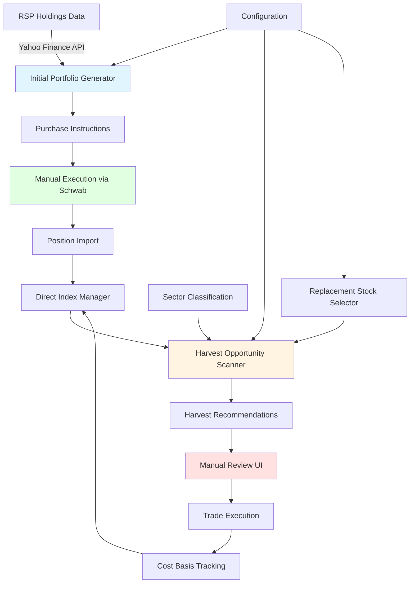

# Direct Indexing Implementation Plan
## Tax Loss Harvesting Based on RSP (Equal-Weighted S&P 500)

**Created**: April 16, 2026  
**Status**: 📋 Planning Phase  
**Priority**: High  
**Estimated Timeline**: 4-6 weeks

---

## Executive Summary

Implement a Direct Indexing system that enables tax-efficient portfolio management by:
1. **Automated Initial Setup**: Generate complete purchase list for all ~500 RSP constituent stocks
2. Tracking individual stock positions that replicate the RSP (Equal-Weighted S&P 500) ETF
3. Identifying tax loss harvesting opportunities (10% loss threshold, configurable)
4. Providing sector-matched replacement stock recommendations to avoid wash sales
5. Integrating with Schwab API for position synchronization and manual trade execution

### Key Benefits
- **Automated Setup**: Generate complete initial purchase list with equal weights for review and execution
- **Tax Alpha**: Harvest losses to offset gains and reduce tax liability
- **Wash Sale Avoidance**: Automatic replacement stock suggestions
- **Sector Diversification**: Maintain RSP-like exposure while harvesting
- **Seamless Integration**: Works with existing portfolio tracking system
- **Manual Control**: Review and approve all trades before execution

### Implementation Approach
**Option C - Automated Initial Setup**: System generates a complete purchase list of all RSP constituents with equal weights, which you review and execute through Schwab. Once positions are established, the system continuously monitors for harvest opportunities.

---

## Architecture Overview



---

## Phase 1: Data Foundation & Initial Setup (Week 1)

### 1.1 RSP Holdings Data Fetcher

**File**: `components/rsp_holdings_fetcher.py`

**Purpose**: Fetch and maintain current RSP constituent holdings from Yahoo Finance

**Key Features**:
- Fetch RSP ETF holdings list (all ~500 stocks)
- Get sector/industry classification for each stock
- Retrieve current prices and market caps
- Cache data locally (refresh daily)
- Handle API rate limits and errors gracefully

**Data Structure**:
```python
@dataclass
class RSPConstituent:
    symbol: str
    name: str
    sector: str  # GICS Sector
    industry: str  # GICS Industry
    market_cap: float
    weight_in_rsp: float  # Equal weight ~0.2%
    current_price: float
    last_updated: datetime
```

**Implementation Notes**:
- Use `yfinance` library for Yahoo Finance API
- Store holdings in SQLite database: `data/rsp_holdings.db`
- Update holdings weekly (RSP rebalances quarterly)
- Fallback to cached data if API unavailable

### 1.2 Sector Classification System

**File**: `components/sector_classifier.py`

**Purpose**: Classify stocks by GICS sectors and create sector groups

**Sectors** (GICS Level 1):
1. Information Technology
2. Health Care
3. Financials
4. Consumer Discretionary
5. Communication Services
6. Industrials
7. Consumer Staples
8. Energy
9. Utilities
10. Real Estate
11. Materials

**Key Functions**:
```python
def get_sector_constituents(sector: str) -> List[RSPConstituent]
def get_stock_sector(symbol: str) -> str
def get_sector_weights(portfolio: pd.DataFrame) -> Dict[str, float]
```

### 1.3 Initial Portfolio Generator

**File**: `components/initial_portfolio_generator.py`

**Purpose**: Generate complete initial purchase list for all RSP constituents

**Key Features**:
- Calculate equal-weight allocation for target investment amount
- Determine share quantities for each stock
- Handle fractional shares and rounding
- Optimize for minimum trade sizes
- Generate formatted purchase instructions
- Export to multiple formats (CSV, Markdown, Schwab-compatible)

**Core Function**:
```python
@dataclass
class InitialPurchase:
    symbol: str
    name: str
    sector: str
    current_price: float
    target_weight: float  # ~0.2% for equal weight
    target_amount: float
    shares_to_buy: int
    actual_amount: float
    fractional_shares: float
    
def generate_initial_portfolio(
    total_investment: float,
    rsp_constituents: List[RSPConstituent],
    min_trade_size: float = 100.0,
    allow_fractional: bool = True,
    exclude_symbols: List[str] = None
) -> Tuple[List[InitialPurchase], Dict[str, Any]]:
    """
    Generate initial purchase list for direct indexing.
    
    Args:
        total_investment: Total amount to invest
        rsp_constituents: List of RSP stocks
        min_trade_size: Minimum dollar amount per trade
        allow_fractional: Whether to allow fractional shares
        exclude_symbols: Stocks to exclude (if any)
    
    Returns:
        (List of purchases, summary statistics)
    """
    num_stocks = len([c for c in rsp_constituents if c.symbol not in (exclude_symbols or [])])
    target_per_stock = total_investment / num_stocks
    
    purchases = []
    total_allocated = 0.0
    
    for constituent in rsp_constituents:
        if exclude_symbols and constituent.symbol in exclude_symbols:
            continue
            
        if constituent.current_price <= 0:
            continue
            
        # Calculate shares
        if allow_fractional:
            shares = target_per_stock / constituent.current_price
            whole_shares = int(shares)
            fractional = shares - whole_shares
        else:
            whole_shares = int(target_per_stock / constituent.current_price)
            fractional = 0.0
        
        actual_amount = whole_shares * constituent.current_price
        
        # Skip if below minimum trade size
        if actual_amount < min_trade_size:
            continue
        
        purchase = InitialPurchase(
            symbol=constituent.symbol,
            name=constituent.name,
            sector=constituent.sector,
            current_price=constituent.current_price,
            target_weight=1.0 / num_stocks * 100,
            target_amount=target_per_stock,
            shares_to_buy=whole_shares,
            actual_amount=actual_amount,
            fractional_shares=fractional
        )
        purchases.append(purchase)
        total_allocated += actual_amount
    
    # Sort by sector, then symbol for organized execution
    purchases.sort(key=lambda x: (x.sector, x.symbol))
    
    # Generate summary
    summary = generate_purchase_summary(purchases, total_investment, total_allocated)
    
    return purchases, summary

def generate_purchase_summary(
    purchases: List[InitialPurchase],
    target_investment: float,
    actual_investment: float
) -> Dict[str, Any]:
    """
    Generate summary statistics for initial portfolio.
    
    Returns:
        {
            'total_stocks': int,
            'target_investment': float,
            'actual_investment': float,
            'unallocated_cash': float,
            'by_sector': Dict[str, Dict],
            'average_position_size': float,
            'largest_position': Dict,
            'smallest_position': Dict,
            'stocks_below_min': int
        }
    """
    pass

def export_purchase_instructions(
    purchases: List[InitialPurchase],
    output_format: str = 'csv',
    output_path: str = None
) -> str:
    """
    Export purchase instructions in various formats.
    
    Formats:
    - 'csv': CSV file for bulk import
    - 'markdown': Human-readable markdown
    - 'schwab': Schwab-specific format
    - 'excel': Excel spreadsheet with multiple sheets
    
    Returns:
        File path or formatted string
    """
    pass
```

**Output Formats**:

1. **CSV Format** (for bulk import):
```csv
symbol,name,sector,shares,price,amount,order_type
AAPL,Apple Inc.,Information Technology,10,150.00,1500.00,MARKET
MSFT,Microsoft Corp.,Information Technology,5,300.00,1500.00,MARKET
...
```

2. **Markdown Format** (for review):
```markdown
# Initial Direct Index Portfolio
Generated: April 16, 2026

## Summary
- Total Investment: $500,000
- Actual Investment: $497,850
- Unallocated Cash: $2,150
- Number of Stocks: 503
- Target per Stock: ~$994
- Average Position: $990

## By Sector

### Information Technology (75 stocks, $74,550)
| Symbol | Name | Shares | Price | Amount |
|--------|------|--------|-------|--------|
| AAPL | Apple Inc. | 10 | $150.00 | $1,500 |
| MSFT | Microsoft Corp. | 5 | $300.00 | $1,500 |
...

### Health Care (62 stocks, $61,628)
...

## Execution Instructions
1. Review all positions and prices
2. Execute trades in batches by sector
3. Use MARKET orders for liquidity
4. Complete all trades within same day
5. Import executed positions into system
```

3. **Schwab Import Format**:
```csv
Account,Action,Symbol,Quantity,OrderType,TimeInForce
12345678,BUY,AAPL,10,MARKET,DAY
12345678,BUY,MSFT,5,MARKET,DAY
...
```

### 1.4 Database Schema

**File**: `migrate_add_direct_indexing.py`

**Tables**:

```sql
-- RSP Holdings (reference data)
CREATE TABLE rsp_holdings (
    symbol TEXT PRIMARY KEY,
    name TEXT NOT NULL,
    sector TEXT NOT NULL,
    industry TEXT,
    market_cap REAL,
    weight_in_rsp REAL,
    current_price REAL,
    last_updated TIMESTAMP
);

-- Direct Index Positions (user's actual holdings)
CREATE TABLE direct_index_positions (
    id INTEGER PRIMARY KEY AUTOINCREMENT,
    account_name TEXT NOT NULL,
    account_type TEXT NOT NULL,
    symbol TEXT NOT NULL,
    shares REAL NOT NULL,
    purchase_price REAL NOT NULL,
    purchase_date DATE NOT NULL,
    cost_basis REAL NOT NULL,
    is_replacement BOOLEAN DEFAULT 0,
    replaced_symbol TEXT,  -- If this was a wash sale replacement
    created_at TIMESTAMP DEFAULT CURRENT_TIMESTAMP,
    FOREIGN KEY (symbol) REFERENCES rsp_holdings(symbol)
);

-- Harvest History (track all harvests)
CREATE TABLE harvest_history (
    id INTEGER PRIMARY KEY AUTOINCREMENT,
    harvest_date DATE NOT NULL,
    account_name TEXT NOT NULL,
    sold_symbol TEXT NOT NULL,
    sold_shares REAL NOT NULL,
    sold_price REAL NOT NULL,
    cost_basis REAL NOT NULL,
    realized_loss REAL NOT NULL,
    replacement_symbol TEXT,
    replacement_shares REAL,
    replacement_price REAL,
    tax_savings_estimate REAL,
    status TEXT DEFAULT 'pending',  -- pending, executed, cancelled
    notes TEXT,
    created_at TIMESTAMP DEFAULT CURRENT_TIMESTAMP
);

-- Replacement Stock Mappings (primary -> secondary)
CREATE TABLE replacement_mappings (
    primary_symbol TEXT NOT NULL,
    secondary_symbol TEXT NOT NULL,
    sector TEXT NOT NULL,
    correlation REAL,  -- For future correlation-based selection
    priority INTEGER DEFAULT 1,
    is_active BOOLEAN DEFAULT 1,
    created_at TIMESTAMP DEFAULT CURRENT_TIMESTAMP,
    PRIMARY KEY (primary_symbol, secondary_symbol)
);

-- Initial Setup Tracking
CREATE TABLE initial_setup_history (
    id INTEGER PRIMARY KEY AUTOINCREMENT,
    setup_date DATE NOT NULL,
    total_investment REAL NOT NULL,
    num_stocks INTEGER NOT NULL,
    account_name TEXT NOT NULL,
    status TEXT DEFAULT 'pending',  -- pending, in_progress, completed
    purchase_file_path TEXT,
    notes TEXT,
    created_at TIMESTAMP DEFAULT CURRENT_TIMESTAMP
);
```

---

## Phase 2: Core Logic (Week 2)

### 2.1 Replacement Stock Selection Algorithm

**File**: `components/replacement_selector.py`

**Strategy**: Sector-based, next largest stock by market cap

**Algorithm**:
1. Identify sector of stock being harvested
2. Get all RSP constituents in same sector
3. Exclude stocks already owned (wash sale risk)
4. Exclude the harvested stock itself
5. Sort by market cap (descending)
6. Select next largest stock not owned
7. If all owned, select from adjacent sector or flag for manual selection

**Key Functions**:
```python
def find_replacement_stock(
    harvested_symbol: str,
    owned_symbols: List[str],
    sector: str,
    exclude_recent_sales: List[str] = None
) -> Optional[Tuple[str, str]]:
    """
    Find suitable replacement stock for harvested position.
    
    Args:
        harvested_symbol: Stock being sold at a loss
        owned_symbols: Stocks currently owned (avoid wash sale)
        sector: GICS sector of harvested stock
        exclude_recent_sales: Stocks sold in last 30 days
    
    Returns:
        (replacement_symbol, reason) or (None, reason)
    """
    pass

def get_sector_alternatives(
    sector: str,
    exclude_symbols: List[str],
    top_n: int = 5
) -> List[RSPConstituent]:
    """Get top N alternative stocks in sector by market cap."""
    pass

def validate_replacement(
    original: str,
    replacement: str,
    recent_trades: List[Dict]
) -> Tuple[bool, str]:
    """
    Validate replacement doesn't trigger wash sale.
    
    Returns:
        (is_valid, reason)
    """
    pass

def build_replacement_mappings(
    rsp_constituents: List[RSPConstituent]
) -> Dict[str, List[str]]:
    """
    Pre-build replacement mappings for all stocks.
    
    Returns:
        Dict mapping each symbol to list of replacement candidates
    """
    pass
```

### 2.2 Tax Loss Harvesting Detection

**File**: `components/direct_index_harvester.py`

**Purpose**: Identify harvest opportunities based on configurable thresholds

**Key Features**:
- Scan all direct index positions for losses
- Apply configurable loss threshold (default: 10%)
- Check holding period (prefer long-term positions)
- Validate wash sale rules
- Calculate estimated tax savings
- Consider AGI and LTCG brackets
- Support gains harvesting in 0% LTCG bracket

**Core Function**:
```python
@dataclass
class HarvestOpportunity:
    symbol: str
    account_name: str
    account_type: str
    shares: float
    purchase_price: float
    current_price: float
    purchase_date: date
    
    # Loss details
    unrealized_loss: float
    loss_percentage: float
    holding_period_days: int
    is_long_term: bool
    
    # Tax impact
    estimated_tax_savings: float
    ltcg_rate: float
    marginal_rate: float
    
    # Replacement
    recommended_replacement: Optional[str]
    replacement_sector: str
    replacement_price: float
    alternative_replacements: List[str]
    
    # Validation
    is_wash_sale_risk: bool
    wash_sale_reason: str
    can_harvest: bool
    harvest_priority: int  # 1-5, higher = better opportunity

def scan_harvest_opportunities(
    portfolio_df: pd.DataFrame,
    account_type: str,
    loss_threshold_pct: float = 10.0,
    gains_threshold_pct: float = 15.0,
    enable_gains_harvesting: bool = True,
    current_agi: float = 0,
    filing_status: str = 'single',
    recent_sales: List[Dict] = None
) -> List[HarvestOpportunity]:
    """
    Scan portfolio for tax loss harvesting opportunities.
    
    Args:
        portfolio_df: Current portfolio holdings
        account_type: Focus on specific account (usually Brokerage)
        loss_threshold_pct: Minimum loss % to consider (default 10%)
        gains_threshold_pct: Minimum gain % for 0% bracket harvesting
        enable_gains_harvesting: Consider gains in 0% LTCG bracket
        current_agi: Current AGI for tax calculations
        filing_status: Tax filing status
        recent_sales: Recent sales for wash sale checking
    
    Returns:
        List of harvest opportunities, sorted by priority
    """
    pass

def calculate_harvest_priority(opp: HarvestOpportunity) -> int:
    """
    Calculate priority score (1-5) for harvest opportunity.
    
    Factors:
    - Loss magnitude (larger = higher priority)
    - Tax savings potential
    - Holding period (long-term preferred)
    - Replacement availability
    - Wash sale risk (none = higher priority)
    
    Returns:
        Priority score: 5 (highest) to 1 (lowest)
    """
    score = 0
    
    # Loss magnitude
    if opp.loss_percentage >= 20:
        score += 2
    elif opp.loss_percentage >= 15:
        score += 1
    
    # Tax savings
    if opp.estimated_tax_savings >= 1000:
        score += 1
    
    # Long-term holding
    if opp.is_long_term:
        score += 1
    
    # Good replacement available
    if opp.recommended_replacement and not opp.is_wash_sale_risk:
        score += 1
    
    return min(score, 5)
```

### 2.3 Configuration System

**File**: `config/direct_indexing_config.yaml`

```yaml
# Direct Indexing Configuration
# ==============================

direct_indexing:
  # Enable direct indexing features
  enabled: true
  
  # Initial setup
  initial_setup:
    # Default minimum trade size (dollars)
    min_trade_size: 100.0
    
    # Allow fractional shares
    allow_fractional: true
    
    # Exclude specific symbols
    exclude_symbols: []
  
  # Harvest thresholds
  thresholds:
    # Minimum loss percentage to trigger harvest alert
    loss_threshold_pct: 10.0
    
    # Minimum dollar loss to consider
    min_loss_amount: 500.0
    
    # Maximum positions to harvest per quarter
    max_harvests_per_quarter: 10
    
    # Consider gains harvesting in 0% LTCG bracket
    enable_gains_harvesting: true
    gains_threshold_pct: 15.0
  
  # Replacement stock selection
  replacement:
    # Strategy: sector_based, correlation_based, manual
    strategy: sector_based
    
    # For sector_based: prefer larger or smaller stocks
    prefer_larger_cap: true
    
    # Minimum market cap for replacement (in billions)
    min_market_cap: 1.0
    
    # Allow cross-sector replacements if needed
    allow_cross_sector: false
    
    # Number of alternative replacements to suggest
    num_alternatives: 3
  
  # Wash sale rules
  wash_sale:
    # Days before/after to check (IRS: 30 days)
    window_days: 30
    
    # Automatically exclude wash sale risks
    auto_exclude: true
    
    # Check substantially identical securities
    check_similar_securities: true
  
  # Data refresh
  data:
    # Refresh RSP holdings frequency (days)
    rsp_refresh_days: 7
    
    # Price update frequency (hours)
    price_refresh_hours: 4
    
    # Cache duration (days)
    cache_duration: 1
  
  # Schwab integration
  schwab:
    # Enable Schwab API integration
    enabled: false
    
    # Auto-sync positions
    auto_sync: false
    
    # Sync frequency (hours)
    sync_frequency_hours: 24
    
    # Require manual approval for trades
    require_approval: true
  
  # Reporting
  reporting:
    # Track tax savings
    track_tax_savings: true
    
    # Generate quarterly reports
    quarterly_reports: true
    
    # Email notifications for harvest opportunities
    email_notifications: false

# Made with Bob
```

---

## Phase 3: Integration (Week 3)

### 3.1 Portfolio Integration

**File**: `components/direct_index_manager.py`

**Purpose**: Bridge between direct indexing and existing portfolio system

**Key Features**:
- Import direct index positions into portfolio DataFrame
- Track positions separately from mutual funds/ETFs
- Maintain lot-level cost basis
- Sync with Schwab API (read-only initially)
- Export to standard portfolio CSV format
- Handle bulk import from initial setup

**Integration Points**:
```python
def import_initial_positions(
    purchase_file: str,
    account_name: str,
    account_type: str = 'Brokerage',
    execution_date: date = None
) -> pd.DataFrame:
    """
    Import initial direct index positions from purchase file.
    
    Args:
        purchase_file: Path to CSV with executed purchases
        account_name: Account name
        account_type: Account type
        execution_date: Date positions were purchased
    
    Returns:
        DataFrame with imported positions
    """
    pass

def import_direct_index_positions(
    account_name: str,
    account_type: str = 'Brokerage'
) -> pd.DataFrame:
    """
    Import direct index positions into portfolio format.
    
    Returns DataFrame compatible with existing portfolio structure:
    month, year, account_name, account_type, owner, symbol,
    name, sector, qty, purchase_price, purchase_date
    """
    pass

def sync_with_schwab(
    account_name: str,
    schwab_connector: Any
) -> Dict[str, Any]:
    """
    Sync direct index positions with Schwab account.
    
    Returns:
        {
            'new_positions': List[Dict],
            'updated_positions': List[Dict],
            'removed_positions': List[Dict],
            'sync_timestamp': datetime
        }
    """
    pass

def export_to_portfolio_csv(
    positions: List[Dict],
    output_path: str = 'data/direct_index_positions.csv'
) -> None:
    """Export direct index positions to CSV for portfolio import."""
    pass
```

### 3.2 Wash Sale Integration

**File**: Extend existing `tax_harvesting.py`

**Enhancements**:
```python
# Add to existing WASH_SALE_REPLACEMENTS constant
DIRECT_INDEX_REPLACEMENTS = {
    # Will be populated dynamically from replacement_mappings table
    # Format: 'PRIMARY_SYMBOL': ['REPLACEMENT1', 'REPLACEMENT2', ...]
}

def check_direct_index_wash_sale(
    symbol: str,
    sale_date: datetime,
    portfolio_df: pd.DataFrame,
    recent_sales: List[Dict]
) -> Tuple[bool, List[str]]:
    """
    Check if selling this direct index position would trigger wash sale.
    
    Returns:
        (is_wash_sale_risk, list_of_conflicting_symbols)
    """
    pass

def get_direct_index_replacement(
    symbol: str,
    sector: str,
    owned_symbols: List[str]
) -> Optional[str]:
    """Get replacement stock for direct index harvest."""
    pass
```

### 3.3 Cost Basis Tracking

**File**: `components/cost_basis_tracker.py`

**Purpose**: Maintain lot-level cost basis for direct index positions

**Features**:
- Track multiple lots per symbol (FIFO, LIFO, SpecID)
- Calculate realized gains/losses on sales
- Handle wash sale adjustments
- Generate tax reports (Form 8949 data)

**Key Functions**:
```python
@dataclass
class TaxLot:
    symbol: str
    shares: float
    purchase_price: float
    purchase_date: date
    cost_basis: float
    account_name: str
    lot_id: str  # Unique identifier

def add_tax_lot(lot: TaxLot) -> None:
    """Add new tax lot to tracking."""
    pass

def sell_shares(
    symbol: str,
    shares: float,
    sale_price: float,
    sale_date: date,
    method: str = 'FIFO'
) -> List[Dict]:
    """
    Sell shares and calculate realized gains/losses.
    
    Returns list of lot dispositions with gain/loss for each.
    """
    pass

def get_unrealized_gains_losses(
    symbol: str,
    current_price: float
) -> Dict[str, float]:
    """Calculate unrealized gains/losses for all lots."""
    pass
```

---

## Phase 4: User Interface (Week 4)

### 4.1 Initial Setup Wizard

**File**: `components/initial_setup_wizard.py`

**Purpose**: Guide user through initial direct index setup

**Workflow**:
```
Step 1: Investment Amount
┌─────────────────────────────────────────┐
│ How much would you like to invest in    │
│ your direct index portfolio?            │
│                                         │
│ Amount: $[_______]                      │
│                                         │
│ This will be split equally across       │
│ ~500 RSP constituent stocks             │
│                                         │
│ [Back] [Next]                           │
└─────────────────────────────────────────┘

Step 2: Configuration
┌─────────────────────────────────────────┐
│ Configure your initial portfolio:       │
│                                         │
│ ☑ Allow fractional shares               │
│ Minimum trade size: $[100]              │
│ Exclude symbols: [________]             │
│                                         │
│ [Back] [Generate Portfolio]             │
└─────────────────────────────────────────┘

Step 3: Review & Export
┌─────────────────────────────────────────┐
│ Initial Portfolio Generated              │
│                                         │
│ • Total Stocks: 503                     │
│ • Total Investment: $497,850            │
│ • Unallocated: $2,150                   │
│ • Avg Position: $990                    │
│                                         │
│ [View Details] [Export CSV]             │
│ [Export Markdown] [Export for Schwab]   │
│                                         │
│ [Back] [Complete Setup]                 │
└─────────────────────────────────────────┘

Step 4: Execution Instructions
┌─────────────────────────────────────────┐
│ Next Steps:                             │
│                                         │
│ 1. Download purchase instructions       │
│ 2. Execute trades in Schwab             │
│ 3. Return here to import positions      │
│                                         │
│ [Download Instructions]                 │
│ [I've Executed Trades - Import Now]     │
└─────────────────────────────────────────┘
```

### 4.2 Direct Indexing Dashboard

**File**: `pages/6_direct_indexing.py`

**Layout**:
```
┌─────────────────────────────────────────────────────────┐
│  📊 Direct Indexing Dashboard                           │
├─────────────────────────────────────────────────────────┤
│                                                          │
│  [Setup] [Overview] [Harvest] [History] [Config]        │
│                                                          │
│  ┌─────────────────────────────────────────────────┐   │
│  │ Portfolio Summary                                │   │
│  │ • Total Direct Index Value: $XXX,XXX            │   │
│  │ • Number of Positions: XXX                      │   │
│  │ • Unrealized Losses: $XX,XXX                    │   │
│  │ • Harvestable Losses (>10%): $X,XXX             │   │
│  │ • YTD Tax Savings: $X,XXX                       │   │
│  │ • Performance vs RSP: +X.X%                     │   │
│  └─────────────────────────────────────────────────┘   │
│                                                          │
│  ┌─────────────────────────────────────────────────┐   │
│  │ Harvest Opportunities (5 found)                  │   │
│  │                                                  │   │
│  │ Priority 5 ⭐⭐⭐⭐⭐                              │   │
│  │ AAPL - Apple Inc.                               │   │
│  │ Loss: -$2,500 (-15.2%) | Tax Savings: $600     │   │
│  │ Replacement: MSFT (Technology)                  │   │
│  │ [Review] [Execute Harvest]                      │   │
│  └─────────────────────────────────────────────────┘   │
└─────────────────────────────────────────────────────────┘
```

**Tabs**:

1. **Setup Tab**: Initial setup wizard (if not completed)
2. **Overview Tab**: Portfolio summary and performance
3. **Harvest Tab**: Current harvest opportunities
4. **History Tab**: Past harvests and tax savings
5. **Config Tab**: Settings and preferences

### 4.3 Harvest Review Modal

**Component**: `components/harvest_review_modal.py`

**Purpose**: Detailed review before executing harvest

**Display**:
```
┌─────────────────────────────────────────────────────┐
│  Review Harvest: AAPL → MSFT                        │
├─────────────────────────────────────────────────────┤
│                                                      │
│  Sell Position:                                     │
│  • Symbol: AAPL (Apple Inc.)                        │
│  • Shares: 100                                      │
│  • Purchase Price: $150.00                          │
│  • Current Price: $127.50                           │
│  • Cost Basis: $15,000                              │
│  • Current Value: $12,750                           │
│  • Unrealized Loss: -$2,250 (-15.0%)                │
│                                                      │
│  Buy Replacement:                                   │
│  • Symbol: MSFT (Microsoft Corp.)                   │
│  • Sector: Technology (same as AAPL)                │
│  • Shares: ~42 (equal dollar amount)                │
│  • Current Price: ~$305.00                          │
│  • Investment: $12,750                              │
│                                                      │
│  Alternative Replacements:                          │
│  • NVDA (NVIDIA Corp.) - $305.00                    │
│  • AVGO (Broadcom Inc.) - $1,250.00                 │
│                                                      │
│  Tax Impact:                                        │
│  • Realized Loss: $2,250                            │
│  • Tax Savings (24% bracket): $540                  │
│  • Wash Sale Risk: ✅ None                          │
│  • Holding Period: 245 days (Long-term)             │
│                                                      │
│  ⚠️  Important Notes:                               │
│  • Do not buy AAPL for 30 days (wash sale rule)    │
│  • Replacement maintains Technology sector exposure │
│  • Review replacement stock fundamentals            │
│                                                      │
│  [Cancel] [Generate Trade Instructions] [Execute]   │
└─────────────────────────────────────────────────────┘
```

---

## Phase 5: Schwab API Integration (Week 5)

### 5.1 Schwab Connector Enhancement

**File**: `components/schwab_direct_indexing.py`

**Purpose**: Extend Schwab API integration for direct indexing

**Features**:
- Read positions from Schwab account
- Identify direct index positions (RSP constituents)
- Sync cost basis and purchase dates
- Fetch real-time prices
- (Future) Execute trades via API

**Key Functions**:
```python
class SchwabDirectIndexConnector:
    def __init__(self, schwab_api: SchwabAPI):
        self.api = schwab_api
    
    def get_direct_index_positions(
        self,
        account_id: str
    ) -> List[Dict]:
        """
        Get all positions that are RSP constituents.
        
        Returns list of positions with:
        - symbol, shares, cost_basis, purchase_date, current_value
        """
        pass
    
    def sync_positions_to_db(
        self,
        account_id: str,
        account_name: str
    ) -> Dict[str, int]:
        """
        Sync Schwab positions to direct_index_positions table.
        
        Returns:
            {'added': N, 'updated': M, 'removed': K}
        """
        pass
    
    def get_real_time_prices(
        self,
        symbols: List[str]
    ) -> Dict[str, float]:
        """Get real-time prices for symbols."""
        pass
```

### 5.2 Manual Approval Workflow

**File**: `components/harvest_approval.py`

**Purpose**: Implement approval workflow for harvest trades

**Workflow**:
1. User reviews harvest opportunity
2. System generates trade instructions
3. User approves or rejects
4. If approved, instructions saved to pending_trades table
5. User executes manually in Schwab
6. User confirms execution in system
7. System updates records and tracking

---

## Phase 6: Reporting & Analytics (Week 6)

### 6.1 Tax Savings Tracker

**File**: `components/tax_savings_tracker.py`

**Purpose**: Track and report tax savings from harvesting

**Metrics**:
- Total losses harvested (YTD, lifetime)
- Estimated tax savings (by year)
- Harvest efficiency (savings per trade)
- Replacement stock performance
- Wash sale violations (if any)

### 6.2 Performance Analytics

**File**: `components/direct_index_analytics.py`

**Purpose**: Analyze direct index performance vs RSP benchmark

**Metrics**:
- Total return vs RSP
- Tracking error
- After-tax return (including harvest benefits)
- Sector drift from RSP
- Cost of implementation (trading costs)

---

## Implementation Timeline

### Week 1: Data Foundation & Initial Setup
- [ ] Set up RSP holdings fetcher
- [ ] Create sector classification system
- [ ] Build initial portfolio generator
- [ ] Design and implement database schema
- [ ] Build data refresh mechanisms

### Week 2: Core Logic
- [ ] Implement replacement stock selector
- [ ] Build harvest opportunity scanner
- [ ] Create configuration system
- [ ] Integrate wash sale checking

### Week 3: Integration
- [ ] Integrate with portfolio system
- [ ] Extend cost basis tracking
- [ ] Connect to existing tax harvesting module
- [ ] Build data import/export
- [ ] Add bulk purchase import functionality

### Week 4: User Interface
- [ ] Create initial setup wizard
- [ ] Create direct indexing dashboard
- [ ] Build harvest review modal
- [ ] Implement trade instructions generator
- [ ] Add configuration UI

### Week 5: Schwab Integration
- [ ] Extend Schwab API connector
- [ ] Implement position sync
- [ ] Build approval workflow
- [ ] Add real-time price updates

### Week 6: Reporting & Testing
- [ ] Build tax savings tracker
- [ ] Create performance analytics
- [ ] Write comprehensive tests
- [ ] Create user documentation
- [ ] End-to-end testing

---

## Success Metrics

### Quantitative
- Successful initial portfolio generation
- Number of harvest opportunities identified per quarter
- Total tax savings generated (estimated)
- Tracking error vs RSP benchmark
- System uptime and reliability

### Qualitative
- Ease of initial setup process
- User satisfaction with harvest recommendations
- Quality of replacement stock suggestions
- Clarity of tax reporting

---

## Next Steps

### Prerequisites for Implementation
- [ ] Review and approve this plan
- [ ] Confirm Schwab API access (or plan for manual entry)
- [ ] Verify RSP as target index
- [ ] Confirm loss threshold (10%)
- [ ] Approve automated initial setup approach

### Ready to Proceed?
Once approved, implementation will begin with Phase 1 (Data Foundation & Initial Setup).

**Estimated Total Effort**: 4-6 weeks  
**Priority**: High  
**Dependencies**: Existing portfolio system, tax harvesting module

---

**Created by**: Bob (Plan Mode)  
**Date**: April 16, 2026  
**Version**: 1.1  
**Status**: 📋 Awaiting Approval